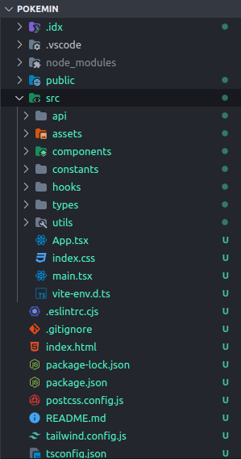

# Folder/Files


**Good to know:** Basically almost all directories/files structure inspired by _**Atomic Design**_


<figure><figcaption></figcaption></figure>

Saya menggunakan folder \`src' supaya di root pathnya telihat lebih ramping, maka kebanyakan aktivitas kodingan lebih banyak dilakukan dalam folder tersebut.

* api\
  Contains all the functions and modules related to making API calls and handling server communication.
* assets\
  Stores static assets like images, fonts, and other media files used in the application.
* components\
  Contains all the UI components of the application.\
  \
  \> There are 3 folders:
  * ui: Reusable UI components that can be used in various places in the application.
  * custom: Specifically for certain needs in the application.
  * sections: Layout for sections in page.
* constants\
  Holds constant values used throughout the application, such as configuration settings, action types, or static text.\
  \> For the variables syntax I use uppercase x snakecase.
* hooks\
  Contains custom React hooks that encapsulate reusable logic.\
  \> Always using the 'use-' prefix for naming children files or main variables.
* types\
  Defines TypeScript types and interfaces used throughout the application.\
  \> Always using the '-d.ts' suffix for children files.
* utils\
  Contains utility functions and helper modules that can be reused across the application.

Untuk saat ini karena fungsi/konstan masih sedikit maka untuk sementara dirampung dalam satu file index saja.

Terkhusus folder dalam komponen, salah satu alasannya dikarenakan menggunakan Shadcn sebagai sumber komponen
